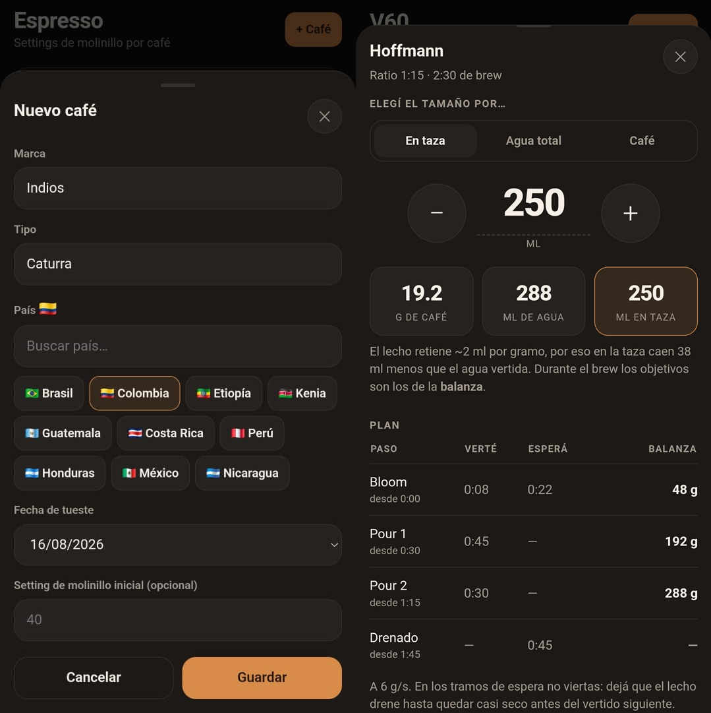

<h1 align="center">☕ CaFriend</h1>

<p align="center">
  <strong>Tu asistente de café, en el bolsillo.</strong><br>
  Seguí la molienda de cada café y preparate un V60 sin mirar una tabla.
</p>

<p align="center">
  
</p>

---

## 🎯 Qué es

Una app web que se instala en el teléfono y funciona **sin internet**. Nació para
reemplazar dos notas de Obsidian: una tabla con el punto de molienda de cada café
y otra con recetas de V60 que había que leer con el celular apoyado en la mesada
mientras se vertía el agua.

Hace dos cosas, y las hace bien:

- 🎛️ **Espresso** — te acordás por vos de en qué número está el molinillo para
  cada café que tenés abierto.
- 🌀 **V60** — te guía paso a paso durante la preparación, con tiempos y pesos.

No tiene cuenta, no tiene servidor, no manda tus datos a ningún lado. Todo vive
en tu teléfono. 🔒

---

## 🎛️ Espresso: dejá de anotar el molinillo en un papel

Cada café que abrís se carga una vez —marca, tipo, país 🇧🇷 y fecha de tueste— y
después la app te muestra **el número del molinillo en grande**, que es lo único
que necesitás ver a las 7 de la mañana.

| Lo que hacés | Lo que pasa |
| --- | --- |
| Tocás el número y lo movés | Queda registrado con fecha y hora |
| Escribís una nota | *“salió amargo, abro un punto”* queda con el cambio |
| Se te acaba el paquete | Pasa a **Finalizados** con todo su historial intacto |

El historial te muestra cada ajuste con una flecha: **↓ más fino**, **↑ más
grueso**. Cuando volvés a comprar el mismo café, ya sabés dónde arrancar.

Además te avisa cuántos días de tueste lleva, porque un café de 2 días todavía
desgasifica y uno de 40 ya perdió lo mejor. 📅

---

## 🌀 V60: una receta, cualquier tamaño

Las recetas no guardan mililitros fijos: guardan **proporciones**. Elegís el
tamaño por donde te resulte más natural y la app calcula el resto.

| Si sabés… | Te dice… |
| --- | --- |
| ☕ Cuánto querés **tomar** (250 ml en taza) | Cuánto café moler y cuánta agua |
| 💧 Cuánta **agua** vas a verter (300 ml) | Cuánto café moler y qué te queda en taza |
| ⚖️ Cuánto **café** tenés molido (18 g) | Cuánta agua verter y qué te queda en taza |

> 💡 **Agua vertida ≠ café en la taza.** El lecho de café se queda con unos 2 ml
> por cada gramo, así que 240 ml de agua sobre 16 g de café dejan ~208 ml en la
> taza. La app maneja los dos números por separado y durante la preparación
> siempre te muestra **el de la balanza**.

Vienen tres recetas cargadas, y podés crear las tuyas:

| Receta | Estilo | Para cuándo |
| --- | --- | --- |
| 🇬🇧 **Hoffmann** | Simple y consistente | Todos los días, café desconocido |
| 🇺🇸 **Rao** | Control y claridad | Especialidad, tuestes claros |
| 🇯🇵 **Kasuya 4:6** | Modulable, pulsado | Cafés frutales, experimentar |

---

## ▶️ El asistente: apretás play y soltás el teléfono

Acá está la gracia. Una vez que arranca la receta, **no hay nada que tocar hasta
que termina**. El teléfono te avisa con un sonido y una vibración distinta cada
vez que tenés que cambiar lo que estás haciendo, así que podés mirar el café en
vez de la pantalla.

En cada momento te dice una sola cosa:

- 💧 **VERTÉ** — cuánto tiene que marcar la balanza y en cuántos segundos.
- ⏸️ **ESPERÁ** — cuánto falta para el próximo vertido. No viertas.

Esa distinción importa: salvo que la receta lo pida explícitamente, **uno no
vierte todo el tiempo**. Vierte, espera a que el lecho drene, y vuelve a verter.
El bloom es el caso más claro: se vierte en unos segundos y se espera medio
minuto. La app calcula cuánto dura cada vertido según el caudal de tu pava, así
que si preparás una jarra más grande, el vertido se alarga solo.

La pantalla se mantiene encendida sola 🔆 y el reloj no se atrasa aunque el
teléfono se distraiga.

---

## 🔍 El truco: el drenado te dice cómo estás moliendo

Cada receta define a qué segundo debería quedar seco el filtro. Comparalo con lo
que pasó de verdad:

| Lo que viste | Qué significa | Qué hacer |
| --- | --- | --- |
| 🐌 Todavía goteaba | Molienda **muy fina** | Abrí el molinillo |
| 🐇 Drenó bastante antes | Molienda **muy gruesa** | Cerralo |
| 🎯 Terminó cerca del objetivo | Estás en punto | Nada, disfrutá |

Tres advertencias honestas, para que no persigas fantasmas:

1. **No es solo la molienda.** La altura del vertido, la agitación y la
   temperatura mueven el drenado tanto como el clic del molinillo.
2. **Los últimos pulsos drenan más lento, y es normal.** Los finos migran y el
   filtro se carga a medida que avanza la preparación.
3. **Más café drena más lento.** El lecho es más profundo. Un mismo tiempo
   objetivo es aproximado si cambiás mucho la dosis.

La señal que más vale es el **tiempo total**; el drenado de cada pulso es una
pista direccional.

---

## 💾 Tus datos son tuyos

Ajustes → **Descargar backup** te da un archivo `.json` con todos tus cafés, su
historial y tus recetas. Sirve para cambiar de teléfono, para reinstalar sin
perder nada, o simplemente para dormir tranquilo.

Al importarlo podés **fusionar** (gana la versión más reciente de cada cosa) o
**reemplazar todo**. 🔁

---

## 📱 Instalación

**Opción A — APK de Android.** Descargá `cafriend.apk`, abrilo en el teléfono y
aceptá instalar desde origen desconocido. La app queda instalada de verdad, con
todo adentro: no necesita internet nunca.

**Opción B — desde el navegador.**

1. Abrí la app en Chrome desde el teléfono.
2. Menú ⋮ → **Agregar a pantalla de inicio**.
3. Listo: queda con su ícono y funciona sin conexión.

> Para que la pantalla se mantenga encendida durante la preparación, la app tiene
> que estar servida por HTTPS. El APK cumple esto solo; desde una IP de red local
> por `http://` todo lo demás funciona, pero esa parte no.

---

## 🛠️ Desarrollo

```bash
npm install
npm run dev      # http://localhost:5173/cafriend/
npm test         # tests de escalado de recetas y de la interfaz
npm run build    # bundle de producción en dist/
```

**Stack:** React + TypeScript + Vite, con `vite-plugin-pwa` para el service
worker. Sin backend y sin librerías de estado: los datos van a `localStorage` y
la lógica de recetas son funciones puras en
[`src/lib/scaling.ts`](src/lib/scaling.ts), cubiertas por tests.

El deploy a GitHub Pages es automático en cada push a `main`
([workflow](.github/workflows/deploy.yml)). Si lo vas a hostear en otro lado,
ajustá `base` en [`vite.config.ts`](vite.config.ts).

### 🤖 Compilar el APK

El APK se arma con [Capacitor](https://capacitorjs.com/): empaqueta la misma app
web dentro de un WebView, sin depender de ningún servidor.

```bash
npm run build:apk    # → dist-apk/cafriend.apk
```

Hace falta un JDK 21 y el SDK de Android. Si no los tenés, se pueden instalar en
una carpeta aparte sin tocar el sistema:

```bash
mkdir -p ~/android-tools && cd ~/android-tools
curl -L -o jdk.tar.gz "https://api.adoptium.net/v3/binary/latest/21/ga/linux/x64/jdk/hotspot/normal/eclipse" && tar xzf jdk.tar.gz
curl -L -o cmdline-tools.zip "https://dl.google.com/android/repository/commandlinetools-linux-11076708_latest.zip"
mkdir -p sdk/cmdline-tools && unzip -q cmdline-tools.zip -d sdk/cmdline-tools && mv sdk/cmdline-tools/cmdline-tools sdk/cmdline-tools/latest
yes | sdk/cmdline-tools/latest/bin/sdkmanager --sdk_root=sdk --licenses
sdk/cmdline-tools/latest/bin/sdkmanager --sdk_root=sdk "platform-tools" "platforms;android-35" "build-tools;35.0.0"
```

El build usa la firma de debug, que alcanza para instalar el APK a mano. Para
publicarlo en Play Store haría falta una clave de release propia.

> La compilación para APK usa `--mode capacitor`, que cambia `base` a `/` y saca
> el service worker: adentro del APK los archivos ya están en el dispositivo y un
> SW cacheando un origen local solo agrega formas de romperse.

---

<p align="center">
  <sub>Hecho para tomar mejor café ☕</sub>
</p>
